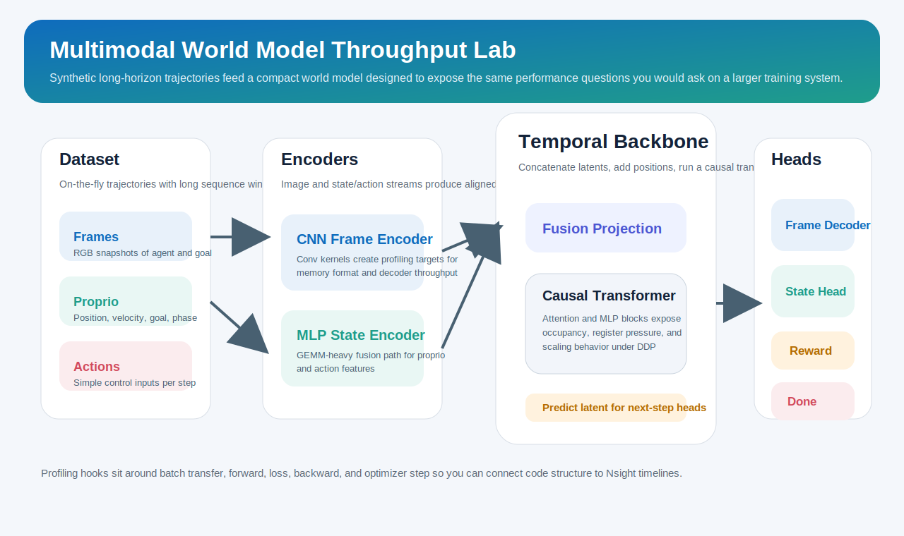
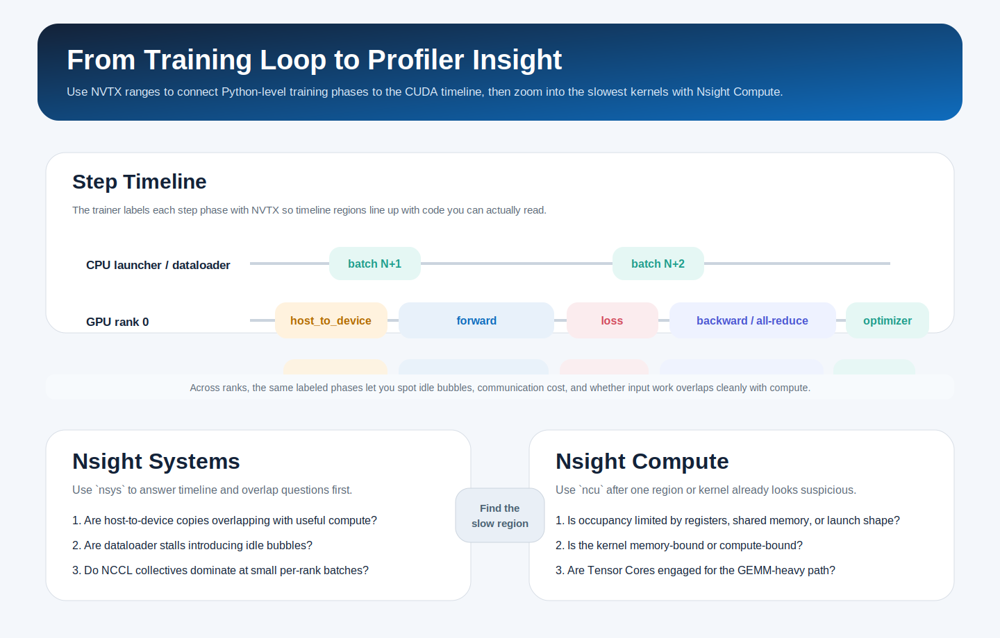
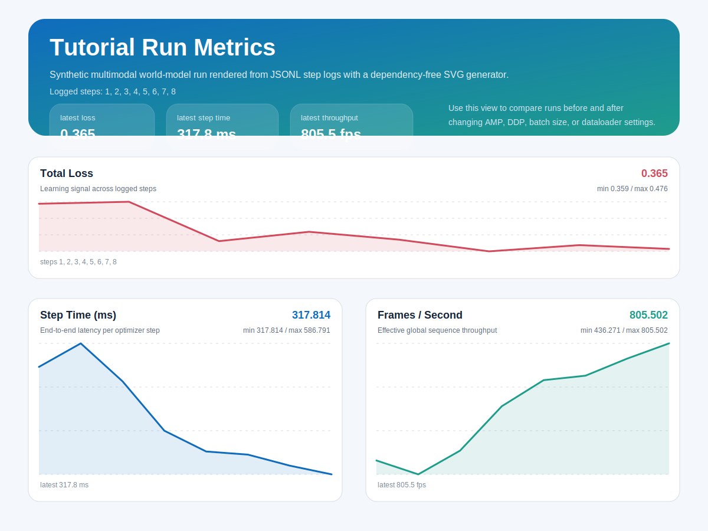

# World Model Throughput Lab

This project turns the resume bullet below into a small, honest learning lab:

> Profiled multi-GPU training loops for large multimodal world models with PyTorch and CUDA; used Nsight Systems and Nsight Compute to trace kernel execution, memory transfers, and occupancy bottlenecks while improving throughput for long-horizon experiments.

The code here does **not** pretend to be a frontier-scale world model. Instead, it reproduces the same engineering workflow on a compact synthetic problem:

- a multimodal sequence dataset with images, proprioception, and actions
- a compact world model that predicts next-frame, next-state, reward, and done
- a `torchrun` + DDP training loop with AMP, pinned-memory transfers, and throughput logging
- NVTX ranges and ready-made `nsys` / `ncu` commands so you can inspect kernels and host-to-device copies

## Tutorial And Visuals

- Step-by-step tutorial: [`docs/tutorial.md`](docs/tutorial.md)
- Visual guide: [`docs/visualizations.md`](docs/visualizations.md)





## What You Will Learn

- How to structure a multimodal world-model training loop in PyTorch
- How DDP changes the launcher, sampler, logging, and checkpoint flow
- How to trace GPU timelines with Nsight Systems
- How to inspect individual kernels and occupancy with Nsight Compute
- How changes like AMP, `channels_last`, worker count, and `torch.compile` affect throughput

## Project Layout

```text
configs/
  baseline.toml
  throughput.toml
scripts/
  train_cpu.sh
  train_multi_gpu.sh
  train_single_gpu.sh
  profile_ncu.sh
  profile_nsys.sh
src/world_model_lab/
  config.py
  data.py
  distributed.py
  model.py
  profiling.py
  train.py
```

## Setup

Install PyTorch for your CUDA version first, then install this project:

```bash
pip install -e .
```

If you only want to run from source:

```bash
PYTHONPATH=src python3 -m world_model_lab.train --config configs/baseline.toml --max-steps 5
```

## Quick Start

CPU smoke run:

```bash
bash scripts/train_cpu.sh
```

Single GPU:

```bash
bash scripts/train_single_gpu.sh
```

Two GPUs with DDP:

```bash
NUM_GPUS=2 bash scripts/train_multi_gpu.sh
```

The trainer writes JSONL metrics to `artifacts/metrics/train_metrics.jsonl` and checkpoints to `artifacts/checkpoints/`.

To render a metrics chart from any run:

```bash
python3 scripts/visualize_metrics.py \
  artifacts/metrics/train_metrics.jsonl \
  docs/assets/tutorial_metrics.svg \
  --title "World Model Training Metrics"
```



## How The Toy Task Works

Each sequence contains:

- `frames`: RGB images of a moving agent and goal marker
- `proprio`: position, velocity, goal coordinates, and phase features
- `actions`: a simple control signal that nudges the agent toward the goal
- `rewards` and `dones`: scalar supervision targets

The model encodes images with a CNN, encodes state/action with an MLP, fuses both streams, runs a causal transformer over time, and predicts the next observation tuple.

That gives you realistic profiling targets:

- CNN kernels from the image encoder/decoder
- GEMM kernels from the MLPs and transformer blocks
- host-to-device copies from batched sequence data
- step-time variation from dataloader and optimizer work

## Profiling With Nsight Systems

Use Nsight Systems when you want the end-to-end timeline:

```bash
NUM_GPUS=2 bash scripts/profile_nsys.sh
```

What to inspect:

1. Whether `host_to_device` ranges overlap cleanly with compute.
2. Whether dataloader stalls create bubbles between steps.
3. Whether forward/backward/optimizer ranges are balanced or skewed.
4. Whether NCCL collectives dominate at your batch size.

The training loop emits NVTX ranges named:

- `step`
- `host_to_device`
- `forward`
- `loss`
- `backward`
- `optimizer_step`

## Profiling With Nsight Compute

Use Nsight Compute when you want per-kernel detail:

```bash
bash scripts/profile_ncu.sh
```

What to inspect:

1. Tensor Core utilization on GEMM-heavy kernels.
2. Occupancy and register pressure on attention / MLP kernels.
3. Memory throughput for decoder convolutions.
4. Whether small batch sizes produce many tiny under-occupied kernels.

Start with `configs/baseline.toml`, then compare to `configs/throughput.toml`.

## Suggested Learning Loop

1. Run the CPU smoke test and read `src/world_model_lab/train.py`.
2. Train on one GPU and watch step time and throughput.
3. Launch with `torchrun` on two GPUs and compare scaling.
4. Capture an `nsys` trace and find idle gaps, copies, and collectives.
5. Capture an `ncu` report and inspect low-occupancy kernels.
6. Toggle one optimization at a time:
   - AMP dtype
   - `channels_last`
   - `pin_memory`
   - `num_workers`
   - `torch.compile`
   - batch size

## Honest Limitations

- The environment is synthetic and generated on the fly.
- The model is intentionally small enough to fit on modest hardware.
- This is for learning systems intuition, not for state-of-the-art world modeling.

That tradeoff is deliberate: the code is short enough to understand, but realistic enough to profile.
